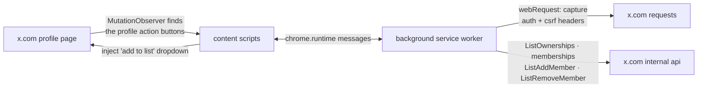

<div align="center">

# easy-twitter-lists

**add people to your x / twitter lists without leaving their profile.**
a small chrome extension that puts an "add to list" dropdown right next to the follow button.

[](https://developer.mozilla.org/docs/Web/JavaScript)
[](https://developer.chrome.com/docs/extensions/develop/migrate/what-is-mv3)
[](https://x.com)

</div>

---

## features

- **one-click list management**: an "add to list" button injected on every profile page
- **see where they already are**: lists the person is already in show up highlighted with a check mark
- **toggle in place**: click a list to add the person, click again to remove them
- **no api keys**: it reuses your logged-in x.com session, nothing to configure
- **matches x's look**: dark dropdown styled to sit next to x's own buttons

---

## how it works



1. the background worker watches your normal x.com traffic and captures the `authorization` and `x-csrf-token` headers
2. with those, it fetches the lists you own
3. when you open a profile, the content scripts ask which of your lists that user is already in, then render the dropdown
4. clicking a list calls x's own add / remove member endpoints with your session

---

## tech stack

- vanilla javascript, no build step, no dependencies
- chrome extension manifest v3 (service worker + content scripts)
- permissions: `webRequest`, `scripting`, `activeTab`, `cookies`, scoped to `https://x.com/*`

---

## getting started

the extension isn't on the chrome web store; load it unpacked:

```bash
git clone https://github.com/kjhq/easy-twitter-lists.git
```

1. open `chrome://extensions`
2. turn on **developer mode**
3. click **load unpacked** and pick the `easy-twitter-lists` folder
4. open [x.com](https://x.com) while logged in, scroll your feed for a moment so the extension can capture your session, then visit any profile

---

## usage

on any profile, click **add to list** next to the follow button. lists the person is already in are highlighted; click any list to toggle membership.

---

## known limitations

- relies on x's internal graphql endpoints, which can change without notice
- the list-fetch query in `background_capture_lists.js` currently has a hardcoded owner user id; change it to your own account id to load your lists
- your lists are fetched once per session; new lists need a reload ([#2](https://github.com/kjhq/easy-twitter-lists/issues/2))
- chrome only for now ([#1](https://github.com/kjhq/easy-twitter-lists/issues/1))

---

## project structure

```
easy-twitter-lists/
├── manifest.json
├── background.js                 # service worker entry, imports the modules below
├── background_header.js          # captures auth / csrf headers from x.com traffic
├── background_capture_lists.js   # fetches the lists you own
├── background_is_member.js       # which of your lists a user is in
├── background_add_member.js      # add / remove list member
├── content_is_profile.js         # detects profile pages (MutationObserver)
├── content_add_lists.js          # builds the dropdown with list state
├── content_initalize_list.js     # dropdown behaviour + toggle clicks
├── content_html.js               # dropdown markup + styles
├── content.js
└── index.html                    # standalone dropdown mockup
```

---

## roadmap

see [open issues](https://github.com/kjhq/easy-twitter-lists/issues) for planned work.

---

<div align="center">

built by [kjhq](https://kjhq.dev) · [@kjhqdev](https://x.com/kjhqdev)

</div>
